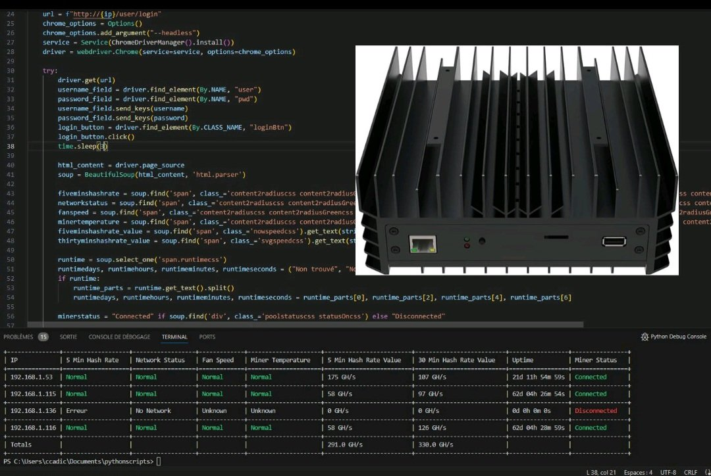
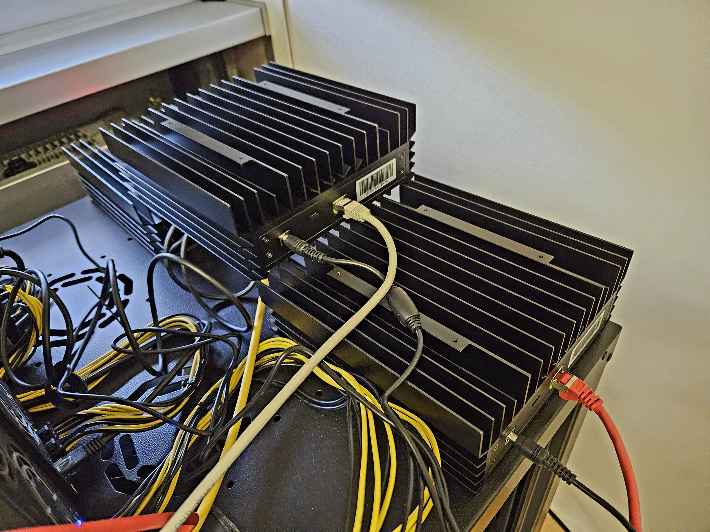

An IceRiver KS0 Minotoring tool

Please unzip# IceRiverKS0Monitor
IceRiver KS0 Monitor Script to monitor several miners

You need to unzip ks0-monitor.zip and ks0-monitor.z01
You need to update: ksaconfig.cfg to reflect the IP addresses and login/pass for your KS0 miners.

This exe is a python compiled exe. You will need Windows (tested on Windows 10 and 11)

I'm not against a KASP reward here: kaspa:qqz3ss00rytt338csdep5h30r4dgn5hptnvwwk92a5wmf433zwlm7awpstuk7 :)
Have fun

